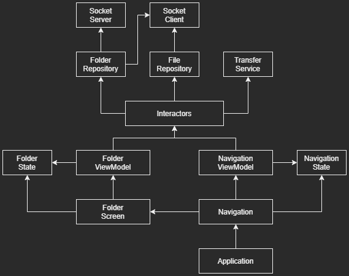

# Stash

Android file sharing application client

**See also:**

[Compose Desktop: client & embedded server](https://github.com/numq/stash-desktop)

[React Electron: client & embedded server](https://github.com/numq/stash-electron)

## Architecture

- **Clean Architecture**
- **Domain driven design**
- **Reactive programming**
- **Functional programming** *- monadic error handling, pipeline, clean functions (side effects
  control)*
- **Screaming architecture** *(features)*
- **MVVM**
- **Unidirectional Data Flow** *(state reduction)*

## Structure



Data layer:

- **Socket client**

Domain layer:

- **Entities (```File```, ```Folder```, etc.)**
- **Interactors (```Start sharing```, ```Share file```, etc.)**
- ```FileRepository```
- ```FolderRepository```
- ```TransferService```

Framework:

- **DI**
- **Context dependent components (OS services, etc.)**
- **Navigation**
- **Presentation (viewModels, screens)**

## Features:

- **Folder sharing mode**
- **Offline mode**
- **Share file** *(if sharing)*
- **Remove file** *(if sharing)*
- **Download file**
- **Show image content**
- **Show file details** *(carousel)*
- **Files selection**
- **Selected files actions**
- **Download multiple files as ZIP**
- **Auto reconnection**
- **Interactive download notifications**

## Tech:

- **Android**
- **Kotlin**
- **Jetpack Compose**
- **ArrowKT**
- **Koin DI**
- **Java WebSocket**